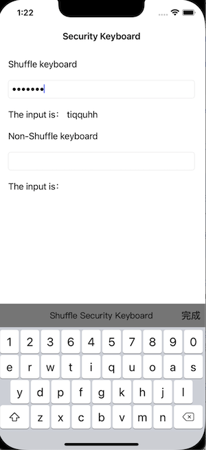

# 安全键盘
[](https://bintray.com/geyifeng/maven/immersionbar) [](https://github.com/gyf-dev)

## 项目介绍
此库提供了一个安全键盘。

基于键盘输入数据的各类信息窃取攻击非常普遍。包括移动金融、电子商务、第三方支付、网络游戏、社交软件等App都存在各类用户信息泄露的环节。大量诸如账号、密码、手机号码、信用卡号、银行卡号、身份证件号码、家庭住址信息、公司地址信息、家庭成员信息、个人私密信息、商业信息等敏感数据被通过App键盘录入移动互联网中。黑客们通过反编译这些流行应用，将键盘钩子（监控程序）捆绑嵌入其中，以监控、窃取用户通过键盘输入的各项数据。

## 效果图



## 如何安装

### CocoaPods

[CocoaPods](https://cocoapods.org) 是Cocoa项目的依赖关系管理器。有关使用和安装说明，请访问他们的网站。要使用CocoaPods将安全键盘集成到您的Xcode项目中，请在“Podfile”中指定它：

```ruby
pod 'HCSecurityKeyboard', :git => 'https://github.com/hccxc/secure-keyboard-ios'
```

## 技术文档

### 如何使用
   ```swift
   let keyboardView = SRTKeyboardView()
   keyboardView.title = "安全键盘"
   keyboardView.titleBackgroundColor = .gray
   keyboardView.titleColor = .black
   
   keyboardView.observeTextChanged = {
      print("监听文字改变")
   }
   /* 
   randomKeys
   false: 使用默认键位排版
   true: 使用完全随机的键位排版
   */
   keyboardView.randomKeys = true
   // 限制最大输入字符个数
   keyboardView.textLimited = 5
   textField.delegate = self
   // 尽量把这句话留到最后，因为组件在这里初始化
   keyboardView.textInput = textField
   ```


## 提醒

- ARC
- iOS>=9.0
- iPhone 

## 许可证

HCSecurityKeyboard在Apache 2.0许可证下可用。有关更多信息，请参阅许可证文件。

